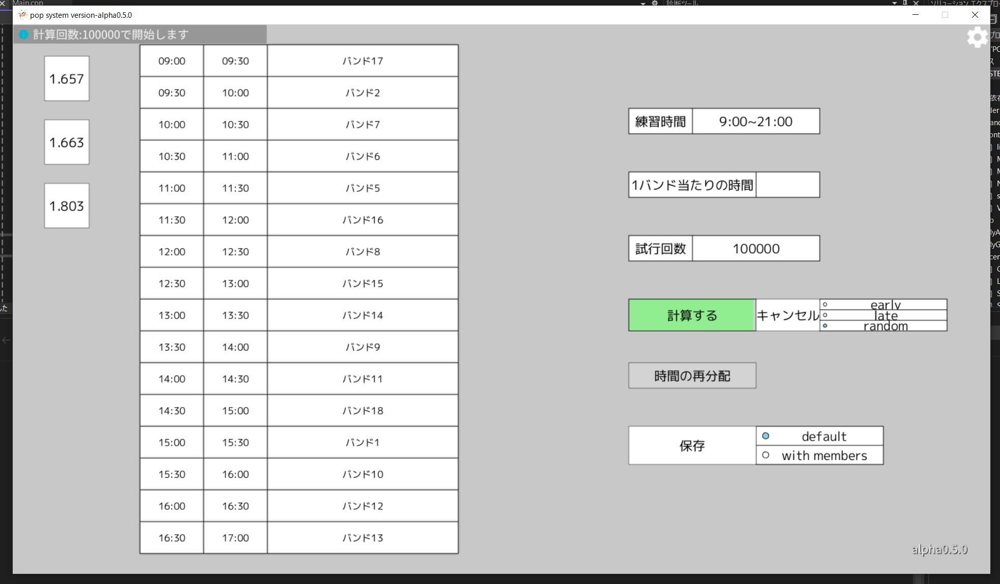

#### システムの概要
このシステムは、サークル活動をするための自動練習順番表作成システムです。日曜日に活動する多くのバンドの練習順番を自動的に決定し、手動で順番を決める負担を軽減します。複数の練習があるメンバーのスケジュールを最適化し、空き時間を最小限に抑えることができます。

</img>
{: align="center"}
図1 作成したシステムのメイン画面

---

#### 特徴
- スプレッドシートと連携して自動で練習順番表を作成
- CSVで出力可能
- 3種類のアルゴリズムで計算
- 複数練習がある場合できる限り練習がまとまるように作成できる
- 試行回数だけ計算し、評価値が高いものを提案する
- GUIを記述するためINIを拡張したEINIを用意
- バンドごとに練習時間を変更可能
- 練習順番表を作成する際に特定のバンドの練習時間を固定可能
- 結果を手動で調整可能

---

#### システムが必要になった経緯
私が所属しているサークルは日曜にしか活動できないうえに、バンドが多く存在します。以前は日曜の朝に集まってその場で練習する順番を決めていましたが、人力で順番を決めるのに1時間近くかかっており、幹部にとって大きな負担となっていました。そこで共有のスプレッドシートを作成し、出席と練習申請をオンラインでできるようにし、それと連携することで自動で練習する順番を決めることを可能にしました。

---

#### EINI形式について
もともとのINI形式に加えて以下の言語仕様を追加しました。
- 定数の定義ができる
- 計算式を記述できる
これにより初期化の目的以外にGUIのレイアウトを簡潔に行うことができるようになりました。

```INI
;定数の定義
def <window_size_x> = 1920
def <window_size_y> = 1080

;":"で囲われた部分は計算式として扱われる
def <scale> = :80/100:

[window]
width = :<window_size_x>*<scale>:
height = :<window_size_y>*<scale>:
```

実行結果
|section|key|value|
|:-:|:-:|:-:|
|window|width|1536|
|window|height|864|

---

#### 今後の発展について
現段階では未発展状態で改善点が多くあります。ほかにも、追加すべき機能が多々ありAlphaでは以下の3つを優先的に実装する予定です。

1. SpreadSheetから取得したデータをアプリ内で変更できるようにする
1. 練習表のデータの保存,呼び出し
1. GUIの改善

---

#### 使用言語
- 言語 ... C++20/23
- ライブラリ ... Open Siv 3D
